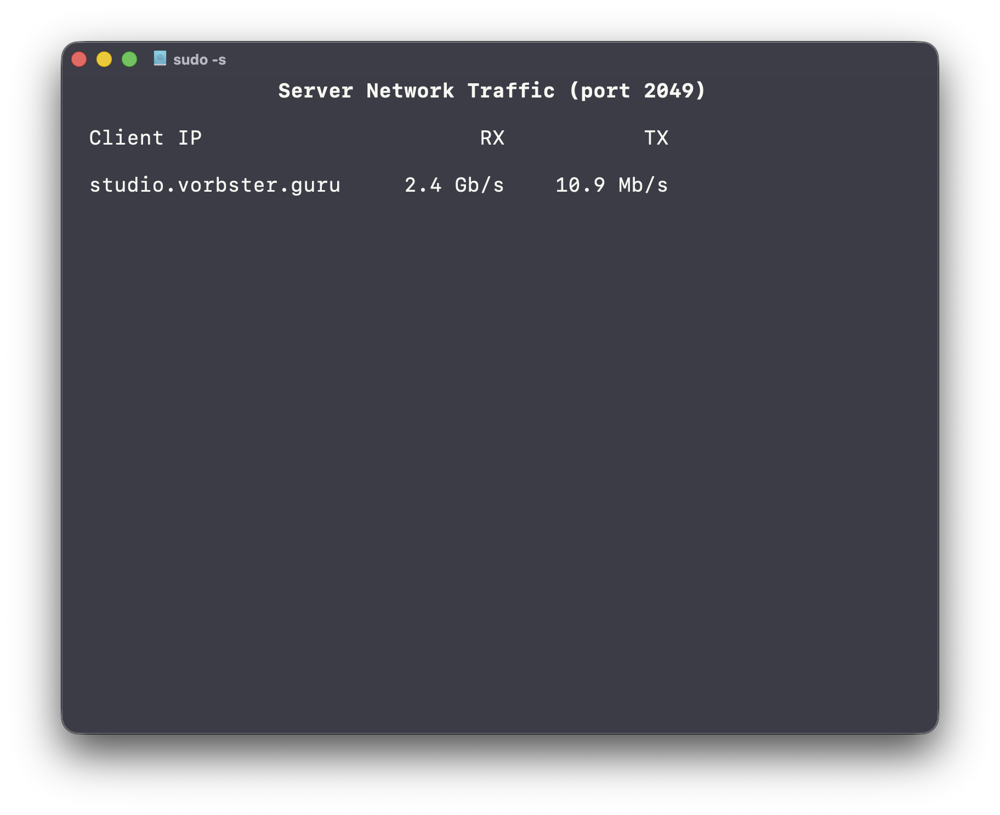

# NFS Receive/Transmit statistics

>> Do not use this program in production, it's intended for testing and educational purposes only.

This directory contains the NFS receive/transmit statistics. The files in this directory are generated by the NFS server and contain information about the number of bytes received and transmitted by the server.

Initially this was intended to be used for monitoring the performance of the NFS server, but it can also be used for other protocols by specifying the port number. 

This is a BCC program that uses eBPF to collect the statistics. The program is written in C and is compiled using the BCC framework. The program is loaded into the kernel and runs in the kernel space, which allows it to collect the statistics without any overhead on the user space.

# Required tools
- BCC (BPF Compiler Collection)
- eBPF (Extended Berkeley Packet Filter)
- Linux kernel version 4.9 or higher

# Usage

To use this program, you need to have the BCC framework installed on your system (In RHEL package python3-bcc pulls all required dependencies). You can then run it using the following command:

```
sudo python3 nfsrtstat.py
```

Arguments:

- `-p` or `--port`: Specify the port number to monitor (default is 2049 for NFS)
- `-n` or `--no-resolve`: Do not resolve IP addresses to hostnames
- `-h` or `--help`: Show help message and exit


